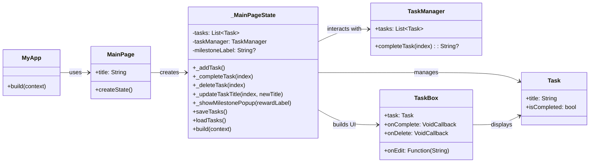
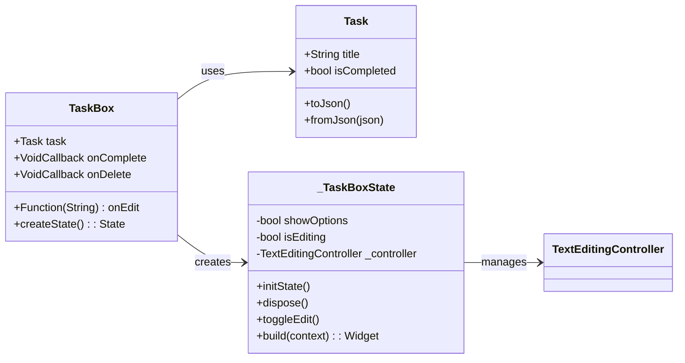

# TaskManagerDart

A in-progress task manager that is meant to help guide and keep track of tasks that could be long, intermediate , or short term.

## Getting Started

Follow the install Guides on the flutter.dev Websites for VS Code
____________________________________________________________
LINK for Windows:

https://docs.flutter.dev/get-started/install/windows/mobile

____________________________________________________________

## Main Class Model



##Methods of Model
```mermaid
    classDiagram
    direction LR

    class Task {
        +String title
        +bool isCompleted
        +Task({title, isCompleted})
        +toJson(): Map~String, dynamic~
        +fromJson(Map~String, dynamic~): Task
    }

    class TaskManager {
        +List~Task~ tasks
        +int completedCount
        +List~Map~ milestones
        +addTask(title)
        +completeTask(index): String?
        +deleteTask(index)
        +updateTaskTitle(index, newTitle)
        +toJson(): Map~String, dynamic~
        +fromJson(json)
    }

    TaskManager --> Task : manages
```
##Methods of widgets


