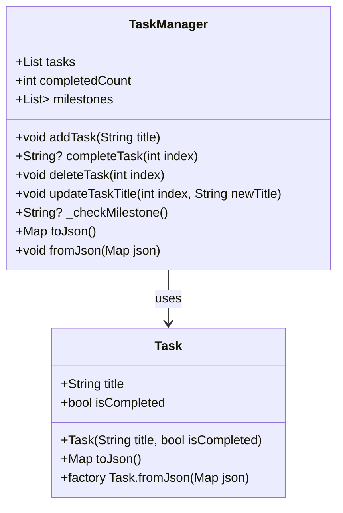
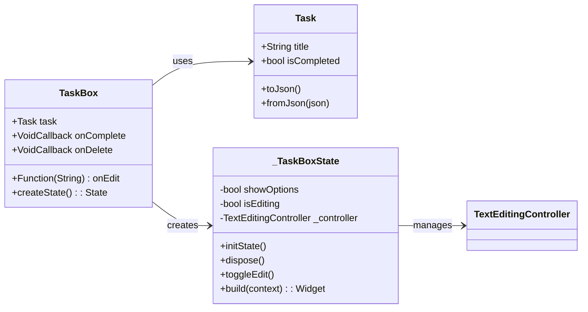

# TaskManagerDart

A in-progress task manager that is meant to help guide and keep track of tasks that could be long, intermediate , or short term.

#Documentation

	The purpose of this application is to provide a service for tracking and prioritizing tasks. A lot of life can happen at once and it can be hard to remember what some of the larger or smaller steps you want to take in life are. Having an application that can provide you with a visual reference to what you were pursing can be a great reminder of what you previously had in mind. With this app you can set different priorities for yourself with reordering. You can complete or delete tasks to set realistic goals and have rewards when you complete a goal.
 
	The app has a main view page with some methods to create a setState and re set that state is altered. The UI is also built within the main page and references the widgets page for its task box in particular. The view then communicates with the model to track the completion numbers and to manage task completion, deletion, and updates to the title. The widget file builds the UI of the task box itself and has a small controller for the removal and the editing saving.
 
	In order to install this application you will first need Visual Studio Code setup which can be easily found online. Once installed you can reference the main page of this Git page where you can click the green code button and copy the HTTPS link. With that link you can open VS code and press clone git repository on the first window popup after opening VS code.  Click the option that appears called clone from git to be able to paste the link you just copied. Once pasted VS code will prompt you to select a destination which will paste the location of where your repository will rest, pick somewhere with ease of access. 
	Moving onto the in app steps, when you pick a destination VS code will pull the code up and bring up a prompt. The prompt will appear at the bottom left of VS code to run the necessary downloads to run the program. Once this is downloaded you will have the correct installs for the code and should be able to run the code. Go to the main file by click the top right paper icon, open lib by clicking its tiny dropdown arrow, and click on main.dart. You should see a play button right by the top of the VS code below the search bar, click that to run with debugging and the app should start after a few moments.
 
	To use the app you can use the pencil icon to edit the names of tasks for what you want. When you finish reclick the pencil icon to save the change. Once you change the name of the task you can shift the order with the three bars on the right, clicking and dragging the tasks up and down. You can click the dropdown arrow to see the complete and delete buttons for when you are done with a task. You can click the top right to save the state of your current tasks and load a old one if you make changes you don’t like. If you want any more tasks click the add button at the bottom right of the app and follow the same process listed previously.
 
	Problems I faced in this project were the learning of Dart and figuring out how to build the app I wanted. A lot of the fixing of those tiny differences came with AI altering to fit my vision closer. The building of different files also came to be an issue with the correct calling of references in methods and the main build. While I could search for the code I needed to learn, it was not easy to understand the meshing of the architecture. It soon became more clear with VS code’s debugging of code and error checking which was tough but wasn’t as broken as I once thought. 
 
	The design side of things did not go to the extend of what I wanted, it was my wish to have something a lot different than the base design. The code I have is a great starting point to be able to continue on later. Issues with the specifics on how flutter adapts graphics makes it difficult to build but AI help and online resources like stackoverflow we reached the starting point it is at now.
 
	Some of the future things I wanted to incorporate has been hinited at but there are a lot of changes id like to push toward. I would like to customize the UI a lot more to better fit my deep vision. I would also like to get this program to run fluidly through a mobile device, maybe to the playstore? I would also like to create a better architecture that does not have a lot of redundancies with its data handling. Better saving in the future would also be ideal, maybe auto saving after changes.

## Getting Started

Follow the install Guides on the flutter.dev Websites for VS Code
____________________________________________________________
LINK for Windows:

https://docs.flutter.dev/get-started/install/windows/mobile

____________________________________________________________

## Main Class Model

##Methods of Model

##Methods of widgets

